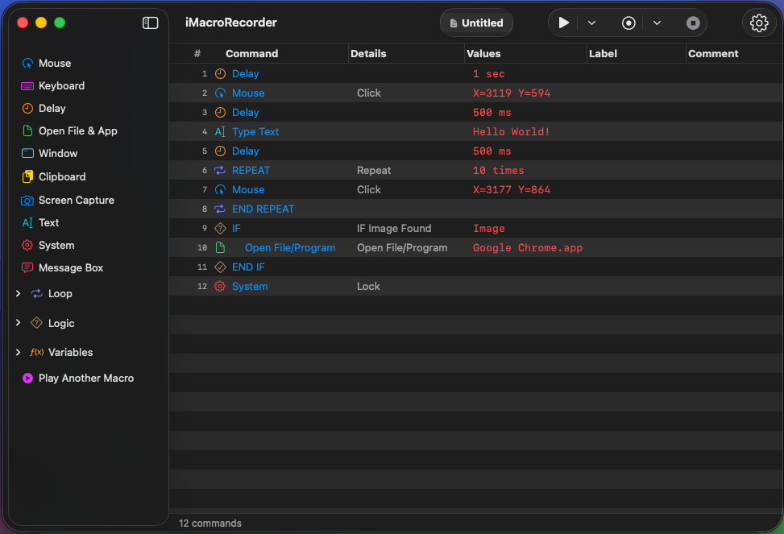

# iMacroRecorder

### Powerful Macro Automation for macOS

**Record, edit and replay mouse and keyboard actions with precision.**

[Features](#core-capabilities) • [Macro Types](#creating-macros) • [Commands](#command-library) • [Settings](#settings--customization) • [Installation](#installation)

---

## Core Capabilities

iMacroRecorder is a professional-grade automation tool designed for macOS. It allows you to automate repetitive tasks by recording your interactions or building complex logic-driven workflows from scratch.

- **High-Fidelity Recording**: Captures mouse clicks, movement paths, and keyboard inputs with millisecond precision.
- **Visual Editor**: Modify any command, reorder with drag-and-drop, or add logic blocks via a clean, intuitive interface.
- **Reactive Automation**: Macros that "see" your screen and make decisions based on image or pixel detection.
- **Global Control**: Start and stop automation from anywhere in macOS using customizable global shortcuts.

---

## Creating Macros

iMacroRecorder supports several levels of automation complexity:

### 1. Sequential Automation
Perfect for simple, repetitive tasks. Just hit record, perform the actions, and play them back. The app captures exact delays to ensure reliable execution.

### 2. Logic-Driven (Reactive) Macros
Go beyond linear playback by using **IF/ELSE** blocks. Your macros can:
- **Image Check**: Wait until a specific button or icon appears on screen before clicking.
- **Pixel Detection**: Monitor a specific pixel's color to detect state changes.
- **File/Window Awareness**: Execute different branches if a certain file exists or a specific window is in focus.

### 3. Loops & Iteration
Automate bulk tasks using the inclusive **REPEAT** blocks. You can set loops to run for a fixed number of iterations or infinitely until manually stopped.

### 4. Modular & Nested Macros
For power users, macros can be modular. Use the **Play Another Macro** command to trigger sub-macros, allowing you to build complex systems from smaller, reusable components.

---

## Command Library

The app provides a wide array of commands to build your workflows:

| Category | Commands |
|:---------|:---------|
| **User Input** | Mouse Clicks (Left/Right/Middle), Mouse Path Recording, Keyboard Events, Text Injection (Plain or System Date) |
| **Flow Control** | IF / ELSE IF / ELSE / END IF, REPEAT / END REPEAT, LABEL & GOTO (for non-linear jumps) |
| **System** | Window Management (Focus, Move, Close), File Operations (Open, Copy, Delete), Clipboard (Read/Write) |
| **Environment** | Image Search, Pixel Color Check, Screen Capture, System Actions (Shutdown, Sleep, Restart) |
| **Utilities** | Variable Management (Set/Modify), Delays (Fixed or Random), Comments, Message Boxes, Sub-Macro Execution |

---

## Settings & Customization

The settings panel allows you to fine-tune both recording and playback behavior:

### General & Recording
- **Theme**: Toggle between Light and Dark modes.
- **Input Filtering**: Choose whether to record mouse movements or keyboard inputs.
- **Micro-Pause Filter**: Set a minimum delay threshold (ms) to keep your macros clean by ignoring unintentional micro-pauses during recording.
- **Stealth Mode**: Automatically hide the main window when recording begins.

### Playback & Safety
- **Abort Triggers**: Instantly stop execution on any keypress, mouse movement, or mouse click.
- **Logic Delay**: Add a global processing delay before logic checks (Image/Pixel) to optimize CPU usage.
- **State Management**: Option to reset all variables automatically on each playback cycle.
- **Visibility**: Toggle automatic window hiding during playback for an unobstructed view.

### Global Shortcuts
All major actions are triggered by system-wide shortcuts that you can fully customize:
- **Record/Stop Actions**
- **Play/Stop Macro**
- **Record from Selection** (starts recording after the highlighted command)
- **Play from Selection** (jumps directly to a specific step in your macro)

---

## Installation

### Download DMG
1. Download the latest `iMacroRecorder.dmg` from the [Releases](https://github.com/mhmmterts/iMacroRecorder/releases) page.
2. Open the DMG and drag **iMacroRecorder** to your **Applications** folder.

## System Requirements

- **macOS** 14.0 (Sonoma) or later
- **Architecture**: Apple Silicon or Intel
- **Accessibility Permission** required

## 💬 Feedback & Support

Found a bug or have a feature request? Please [open an issue](https://github.com/mhmmterts/iMacroRecorder/issues) on GitHub. I appreciate your feedback!

---

[⬆ Back to Top](#imacrorecorder)

